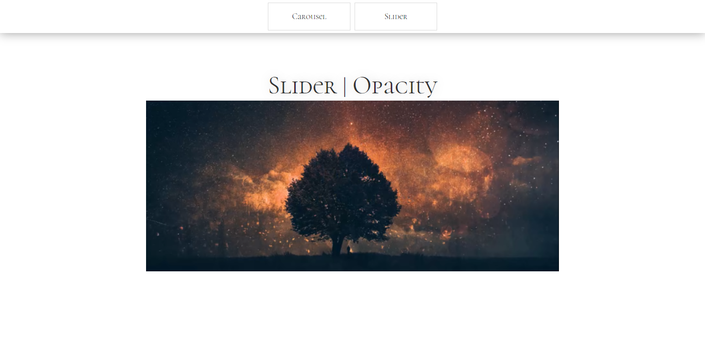

# Carousel | Code/Drops #39

## Project
    - Carousel developed with HTML, CSS and JS.

## CSS | New knowledges
    - body{ place-items: center; } 
        - Align objects to the center 
    - scroll-snap-type: x mandatory; | scroll-snap-align: start; | -webkit-overflow-scrolling: touch;
        - They make the scroll not stay between two objects.
    - pointer-events: none;
        - Disable pointer events
## JS | New knowledges
    - elem.addEventListener('wheel', function(){});
        - Add function on the mouse wheel

## Screens

## References
[Code/Drops#39](https://youtu.be/SGwHpzgqzgk)